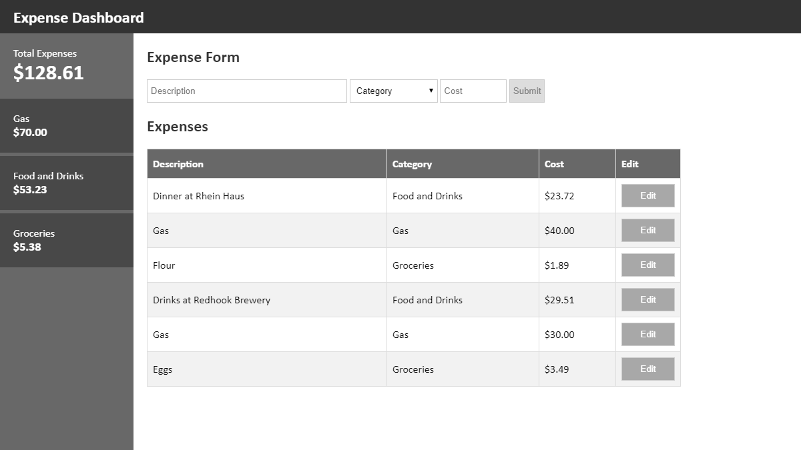

# Description

This expense dashboard is a simple Ember.js application that serves as a variation of the traditional todo list application:

# Project Setup

## Prerequisites

One will need the following things properly installed on your computer:

* [Node.js](https://nodejs.org/) (with npm)
* [Ember CLI](https://ember-cli.com/)

## Installing the application

* `git clone https://github.com/eddylu94/ExpenseDashboard.git`
* `cd expense-dashboard`
* `npm install`

## Running the application

* `ember serve`
* Visit the application at [http://localhost:4200](http://localhost:4200)